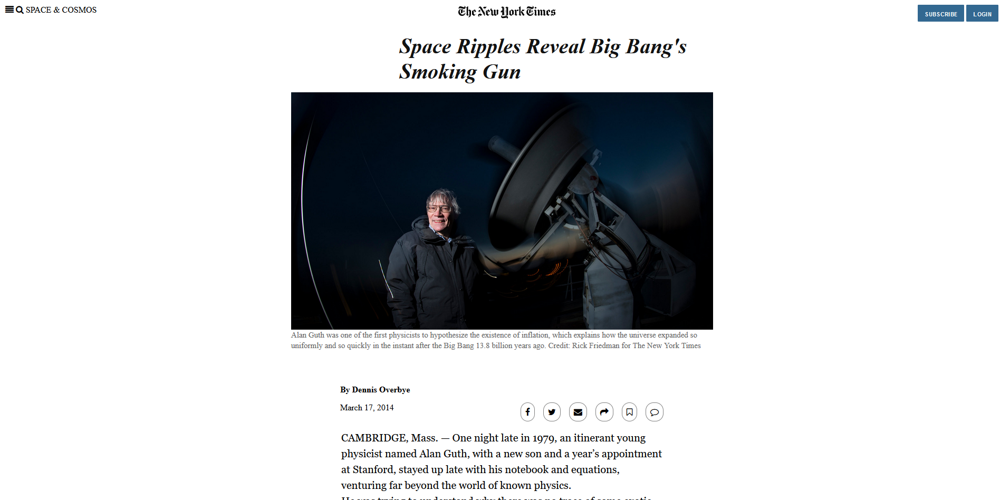
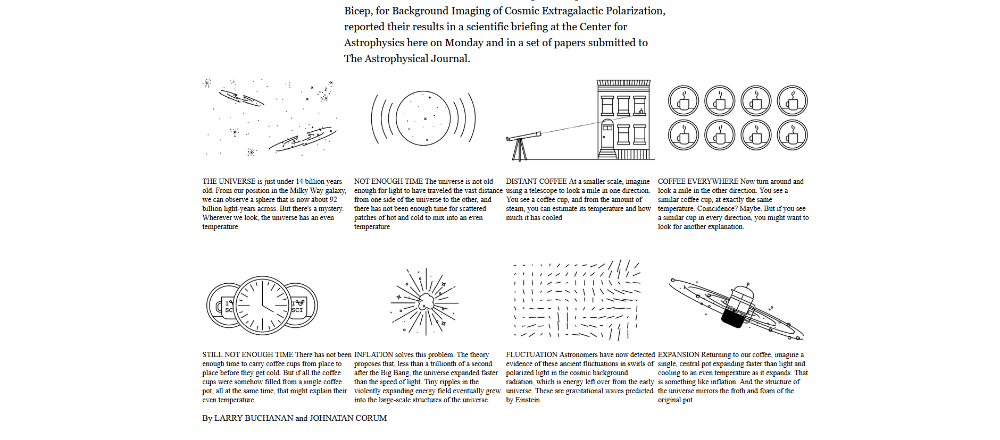
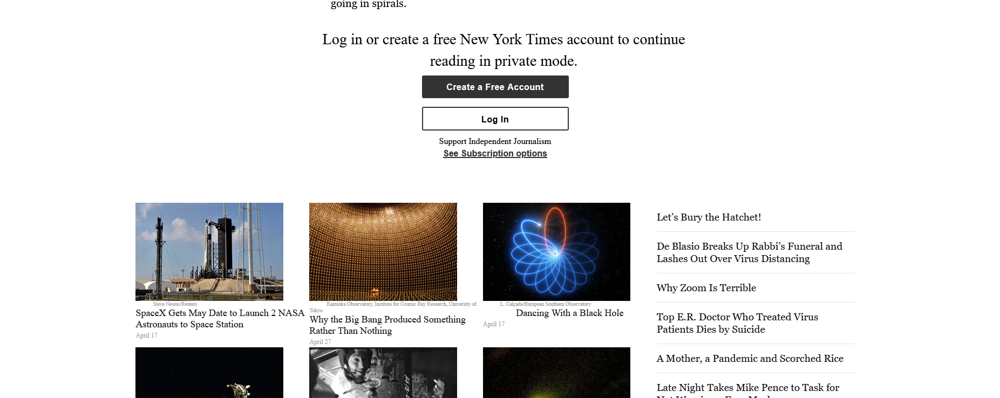

Microverse #3 Project ,  Main Course HTML & CSS, NYTimes Newspaper Clone

                                          Main Preview

The focus of this project is to recreate with HTML and CSS the look of this article https://www.nytimes.com/2014/03/18/science/space/detection-of-waves-in-space-buttresses-landmark-theory-of-big-bang.html?_r=0 (opened on a private browser).

Built Using:

HTML  
CSS

Authors:

Ignacio Asis:
  Github: @KennyUTN

  (https://github.com/KennyUTN)
