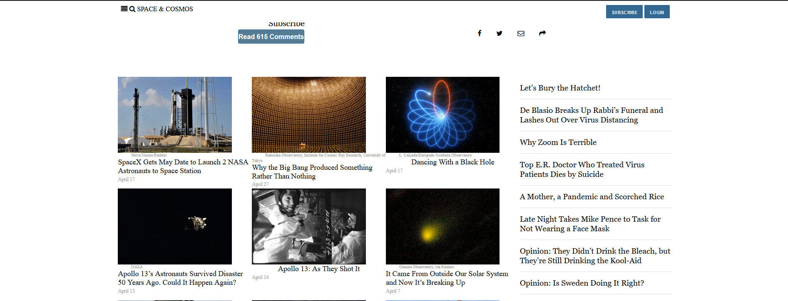

  # Microverse HTML-CSS Project: NYTimes Article Clone

> The following is a front-end copy of an article from NYtimes.com. The main purpose of the project is to learn about positioning and floating elements on with css.

Additional description about the project and its features.
## Main features
>Header
>Article Section
>Inflation Section
>More News Grids
>Links Footer

## Built With

- HTML
- CSS

## Live Demo

[Live Demo Link](https://livedemo.com)

## Authors

👤 **Ignacio Asis**

- Github:  @KennyUTN  [@githubhandle](https://github.com/KennyUTN)

## 🤝 Contributing

Contributions, issues and feature requests are welcome!

Feel free to check the [issues page](issues/).

## Show your support

Give a ⭐️ if you like this project!
